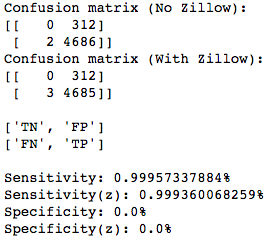

Project proposal: Predicting the return of peer to peer loans
======
------
## Project goals:

###1. Create Model for predicting loan success
###2. Improve model by adding another source of information

---

## Incorporating Zillow data:

* Challenges
* calculate the slope of the rents over the interval that the loans occurred. Add slope & intercept as features to the model

---

## Model Performance & Comparison:
### Accuracy Scores

* Using grid search with logistic regression to fit a model both with and without the zip code data.
Results: slightly different models!

---
## Model Performance & Comparison:
### Confusion Matrices

* For another comparison of performance, look at the confusion matrices:
Very small difference in predictions

---
## Model Performance & Comparison:
### ROC & AUC 

* How I actually did it

---

